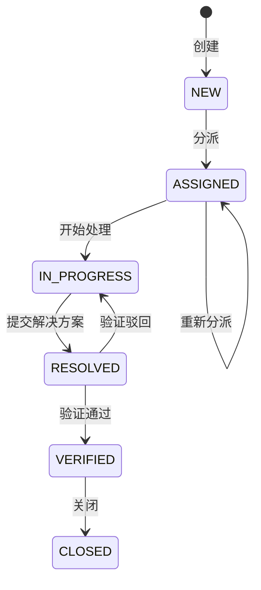

# 问题单跟踪系统

面向约 20 万注册用户的问题单管理系统。第一版采用可水平扩展的模块化单体，覆盖注册登录、问题单创建与流转、验证关闭以及 RBAC 权限控制。

## 技术栈

- 后端：Java 17、Spring Boot 3.5、Spring Security、Spring Data JPA
- 数据：PostgreSQL、Redis、Elasticsearch
- 服务发现：Nacos
- 前端：Vue 3、TypeScript、Vite、Pinia、Element Plus
- 部署：Docker Compose、Nginx

Elasticsearch 用于全文检索，不作为权威数据源；检索服务不可用时自动回退 PostgreSQL。Redis 用于刷新令牌、会话状态和后续热点缓存扩展。

## 核心流程



每次流转都会写入 `ticket_transitions` 审计表。问题单带 JPA 乐观锁版本号，过期操作返回 HTTP `409`。

## 角色权限

| 角色 | 默认能力 |
| --- | --- |
| `USER` | 创建问题单、查看本人相关问题单 |
| `AGENT` | 查看全部问题单、处理被分派的问题单 |
| `REVIEWER` | 验证、驳回和关闭问题单 |
| `ADMIN` | 全部权限、分派问题单、管理用户角色 |

新注册用户默认获得 `USER` 角色。首次启动会创建管理员：

- 用户名：`admin`
- 默认密码：`Admin@123456`

生产环境必须通过环境变量修改管理员密码与 JWT 密钥。

## Docker 启动

1. 复制环境变量模板并修改密钥：

   ```powershell
   Copy-Item .env.example .env
   ```

2. 启动全部服务：

   ```powershell
   docker compose up --build -d
   ```

3. 访问：

   - Web：`http://localhost`
   - 后端健康检查：`http://localhost:8080/actuator/health`
   - Nacos 控制台：`http://localhost:8081`
   - Elasticsearch：`http://localhost:9200`

## 本地开发

先用 Docker 启动基础设施：

```powershell
docker compose up -d postgres redis elasticsearch nacos
```

后端：

```powershell
Set-Location issuetracker-end
mvn -s .mvn/settings.xml spring-boot:run
```

前端：

```powershell
Set-Location frontend
npm.cmd install
npm.cmd run dev
```

开发地址为 `http://localhost:5173`，Vite 会将 `/api` 代理到 `8080`。

## 主要接口

| 方法 | 路径 | 说明 |
| --- | --- | --- |
| `POST` | `/api/auth/register` | 注册 |
| `POST` | `/api/auth/login` | 登录 |
| `POST` | `/api/auth/refresh` | 轮换刷新令牌 |
| `GET` | `/api/tickets` | 分页检索问题单 |
| `POST` | `/api/tickets` | 创建问题单 |
| `POST` | `/api/tickets/{id}/assign` | 分派 |
| `POST` | `/api/tickets/{id}/start` | 开始处理 |
| `POST` | `/api/tickets/{id}/resolve` | 提交解决方案 |
| `POST` | `/api/tickets/{id}/verify` | 验证通过或驳回 |
| `POST` | `/api/tickets/{id}/close` | 关闭 |
| `PUT` | `/api/admin/users/{id}/roles` | 设置角色 |

## 20 万用户容量设计

- 应用无状态部署，访问令牌使用 JWT，刷新令牌集中存放 Redis，可通过 Nacos 注册多个后端实例。
- PostgreSQL 对问题单常用过滤组合建立复合索引；连接池大小可通过 `DB_POOL_SIZE` 调整。
- 全文搜索进入 Elasticsearch，数据库仍是唯一权威数据源。
- 流转写入短事务并使用乐观锁，避免长事务和并发覆盖。
- 列表接口最大每页 100 条，避免无界查询。
- 密码使用 BCrypt 12 轮散列，刷新令牌随机生成且每次刷新后立即轮换。

生产部署建议使用 PostgreSQL 主备与读副本、Redis Sentinel/Cluster、至少 3 节点 Elasticsearch、Nacos 集群，并在入口增加限流、WAF、TLS、审计日志归档和 Prometheus 告警。

## 目录

```text
issuetracker-end/   Spring Boot API、Flyway 数据库迁移、单元测试
frontend/  Vue 3 管理界面
docker-compose.yml
```